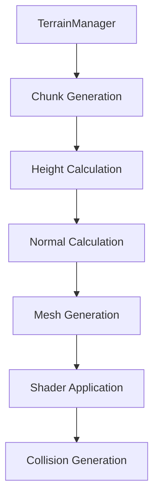

# Etheria Voxel Terrain System

## Architecture Overview

The terrain system uses a **heightmap-based voxel approach** with procedural generation.

## Core Components

### TerrainManager (`_engine/terrain/terrain_manager.gd`)
- Manages chunk loading/unloading around player
- Handles terrain modification requests
- Routes modifications to correct chunk

### Chunk (`_engine/terrain/chunk.gd`)
- Generates mesh from heightmap data
- Stores modified heights in `height_data` dictionary
- Calculates per-vertex normals for slope detection
- Applies terrain shader material

### BiomeManager (`_world/biomes/biome_manager.gd`)
- Legacy color-based biome system (superseded by shader)
- Temperature/humidity noise for biome selection

## Terrain Shader System

### Features
| Feature | Implementation |
|---------|---------------|
| **Triplanar Mapping** | Prevents texture stretching on slopes |
| **Height-based Materials** | Beach → Grass → Rock → Snow |
| **Slope Detection** | Snow only on flat surfaces (dot > 0.7) |
| **Procedural Noise** | FBM noise for color variation |

### Height Thresholds (Configurable)
- `beach_max_height`: 5m
- `grass_max_height`: 25m
- `rock_max_height`: 40m
- `snow_min_height`: 35m

## Mining System

### How It Works
1. `PlayerMining` (RayCast3D) detects terrain hits
2. On attack/use, calls `TerrainManager.modify_terrain()`
3. TerrainManager routes to correct Chunk
4. Chunk updates `height_data` and regenerates mesh

### Tool Types
| Tool | Dig Multiplier | Best For |
|------|---------------|----------|
| Hand | 0.3x | Emergency |
| Pickaxe | 1.5x | Stone/Rock |
| Shovel | 1.2x | Dirt/Sand |

## Future Improvements

### Planned: True SDF Voxel System
Current system is 2D heightmap. Future upgrade:
- 3D Signed Distance Field storage
- Octree for LOD
- Surface Nets meshing
- Proper cave/overhang support

### Planned: Biome Integration
- Temperature/humidity affect shader colors
- Biome-specific vegetation placement
- Faction territory color tinting
